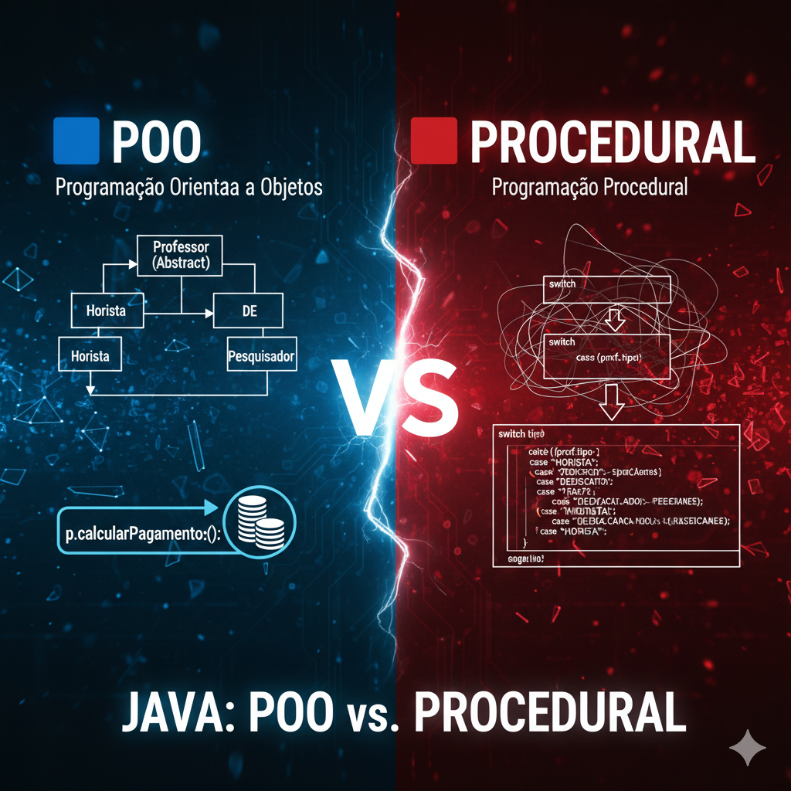

# Sistema de Pagamento de Professores

Este projeto implementa um sistema completo de cálculo salarial para diferentes categorias de professores de uma universidade, utilizando duas abordagens:

- **POO (Programação Orientada a Objetos)**
- **Programação Procedural (sem POO)**

O objetivo é comparar, na prática, os dois paradigmas de desenvolvimento, destacando vantagens, desvantagens e diferenças de implementação.

## Download 🎥 Vídeo de Explicação

Clique na imagem abaixo para **baixar** o vídeo diretamente:

[](./explicacao.mp4?raw=true)

---

## 📚 Regras de Negócio

### **Professor Horista**
- Recebe **R$ 85,00 por hora-aula**
- Máximo de **160h/mês**

### **Professor Dedicação Exclusiva**
- Salário fixo de **R$ 8.000,00**
- + **R$ 1.500,00 por titulação** (mestre/doutor)

### **Professor Pesquisador**
- Salário base de **R$ 5.000,00**
- + **R$ 2.000,00 por projeto ativo**

---

# 🟦 Versão POO (Programação Orientada a Objetos)

A estrutura é composta por:


### ✔ Classe abstrata `Professor`
Define:
- Nome do professor
- Método abstrato `calcularPagamento()`

### **✔ Três subclasses:**

- `ProfessorHorista`
- `ProfessorDedicacaoExclusiva`
- `ProfessorPesquisador`

Cada uma implementa sua própria regra de cálculo salarial.

### ✔ Polimorfismo e lista heterogênea

Exemplo utilizado no `Main`:

```java
List<Professor> professores = new ArrayList<>();
```

O polimorfismo ocorre ao chamar:

```java
p.calcularPagamento();
```

Cada professor usa sua própria versão do método.

---

# 🆚 Diferença Entre a Versão POO e a Versão Sem POO

A seguir você encontrará uma explicação clara, organizada e interativa mostrando a diferença entre as duas implementações.

---

## 🔍 Visão Geral

| Abordagem | Característica Principal | Vantagens | Desvantagens |
|-----------|--------------------------|-----------|--------------|
| **POO** | Cada tipo de professor vira uma classe | Polimorfismo, herança, organização, escalabilidade | Mais arquivos |
| **Procedural** | Toda lógica concentrada em um único método | Simples e rápida de escrever | Difícil de manter e não escalável |

---

# 📦 Explicações Interativas

Clique para expandir:

---

<details>
<summary><strong>📁 Estrutura do Código (POO vs Procedural)</strong></summary>

## 🟦 POO – Organização por Classes
- `Professor` (abstrata)
- `ProfessorHorista`
- `ProfessorDedicacaoExclusiva`
- `ProfessorPesquisador`
- `Main`

Mais limpo, profissional e preparado para crescer.

---

## 🟥 Procedural – Código Centralizado
- Apenas uma classe (`MainProcedural`)
- Uma estrutura para dados
- Um método `calcularPagamento()`
- Toda lógica no `switch-case`

Bom para exercícios simples, ruim para escalabilidade.
</details>

---

<details>
<summary><strong>⚙️ Polimorfismo (POO) vs Switch-case (Procedural)</strong></summary>

## 🟦 POO – Polimorfismo
Cada objeto professor sabe calcular seu próprio pagamento:

```java
p.calcularPagamento();
```

O Java identifica qual método chamar automaticamente.

---

## 🟥 Procedural – Switch-case
No modelo procedural, você precisa decidir tudo manualmente:

```java
switch (prof.tipo) {
    case "HORISTA":
    case "DEDICACAO":
    case "PESQUISADOR":
}
```

Menos flexível e mais propenso a erros.
</details>

---

<details>
<summary><strong>🚀 Escalabilidade e Manutenção</strong></summary>

## 🟦 POO
Para adicionar um novo tipo (ex: ProfessorVisitante), basta:

- Criar uma nova classe
- Implementar `calcularPagamento()`

Nada mais precisa ser modificado.

---

## 🟥 Procedural
Para adicionar um novo tipo você deve:

- Modificar o `switch-case`
- Adicionar novos atributos
- Possivelmente alterar outras partes do código

Mais arriscado e menos sustentável.
</details>

---

# 📊 Tabela Comparativa Final

| Critério | POO | Sem POO |
|----------|------|---------|
| Organização | ⭐⭐⭐⭐⭐ | ⭐⭐ |
| Reutilização | Alta | Baixa |
| Polimorfismo | ✔ | ❌ |
| Escalabilidade | Alta | Baixa |
| Manutenção | Fácil | Difícil |
| Adicionar novo tipo | Fácil (nova classe) | Difícil (alterar switch-case) |
| Ideal para | Sistemas reais | Exercícios simples |

---

# 💬 Resumo Final

> A versão **POO** é mais organizada, modular, escalável e usada em sistemas reais.
> A versão **Procedural** é simples e rápida, porém pouco escalável e difícil de manter.

---

# ▶️ Como Executar

## 🟦 POO
```bash
cd poo
javac *.java
java Main
```

## 🟥 Sem POO
```bash
cd semPOO
javac MainProcedural.java
java MainProcedural
```

---

# 🛠 Tecnologias Utilizadas

- Java 17+
- Programação Orientada a Objetos
- Estruturas de Dados (`List<>`)
- Formatação com `DecimalFormat`

---

# 📄 Licença
